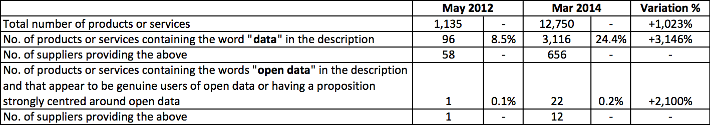
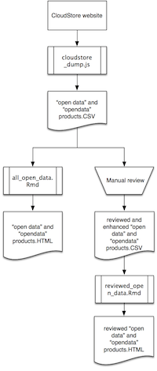

## Summary

The objective of this project is to:
- make the profiles of products and services published on HM Government's "CloudStore" website at [http://govstore.service.gov.uk/cloudstore](http://govstore.service.gov.uk/cloudstore) available in a machine-readable format
- use that data to analyse how, of all CloudStore products and services, *open data* products have changed over the last two years by comparison with an available dump of the same data from May 2012
- produce lists of open data products and services that address specific categories of services such as: hosting, consultancy, analysis, conversion or visualisation. 

## Table of contents
- [Results](#results)
  - [The figures](#the-figures)
  - [The review](#the-review)
  - [The reports](#the-reports)
- [Methodology](#methodology)
  - [Scraping](#scraping)
  - [Reviewing](#reviewing)
- [The cloudstore_dump.js command line tool](#cloudstore_dumpjs-command-line-tool)

## Results

### The figures
On 23 March 2014, 656 companies listed on CloudStore 3,116 products and services whose description included the word "data", over a total of 12,750 products.

Of these, 12 companies offered 22 products and services users that make explicit use of open data or have a proposition that is strongly centred around open data, as verified by one of our reviewers.

In respect to the only previous snapshot we have of CloudStore, dated May 2012, we can see how the attention to data services and to open data in particular has increased substantially. 

At the time, the whole of CloudStore was about 1/10th of the size of today and listed 1,135 products and services. We had 58 suppliers offering 96 data products and services, 1 of which only referred to "open data".

This means that within the success of CloudStore's +1,023% growth in 22 months (112% month-on-month, like saying that it doubled in size every month), services whose description refer to the "data" keyword grew by +3,146%. Open data services in particular grew by +2,100%.

### The review
Services were reviewed "manually" by a reviewer to assess if the references to open data were substantiated by some degree of fact or were rather attempts to just take advantage of open data as a buzzword. The numbers above are the ones resulting following the review. 61 product and services originally referenced open data but only 22 showed in the end to be genuine users of open data or having a proposition strongly centred around open data.

### The reports
Note that GitHub will only display the source of the two reports listed below. To view them as a conventional user would, save them locally first.
- [all_open_data](reports/all_open_data.html) is the report generated by simply searching CloudStore for products that match "open data" and "data".
- [reviewed_open_data](reports/reviewed_open_data.html) is the report derived from the above that is enhanced with the reviewer's work in rating and categorising the datasets. 

## Methodology

The diagram below illustrates the overall workflow of stages and components the projects developed through.

### Scraping 
The data on CloudStore is open data, licensed under [OGL](http://www.nationalarchives.gov.uk/doc/open-government-licence/version/2/), but it is not downloadable in machine-readable format. As scraping was the only option that was available, we studied the website and realised that the only practical way to identify all data-related products and services was to search the website for the keywords we were interested in, using its own full-text search functionality and to scrape the resulting list. 

We found that the lists produced this way could:
- return duplicates, 
- include products whose descriptions actually did *not* include the searched terms (e.g. when a keyword is part of the supplier name), or
- miss products whose description actually *did* include the search terms (e.g. some products that were listed when searching for "open data" did not show up when searching simply for "data"). 
The last case in particular appears to be a bug of the CloudStore system but, because of our limited access to the system, we could not investigate further but just arrange workarounds to limit how our work was impacted by the issue.
All results were then filtered to avoid duplicates and include only those products whose description contain the relevant keywords.

It is also to be noted that some of the search terms could have alternative spellings, e.g. we found that several suppliers wrote "open data" without spaces.

To calculate the total number of products and services instead, our script crawled the website by using its two-layered category structure and listed all of its products. Once again, duplicates were identified and the resulting number of unique products considered into our calculations. 

### Reviewing
Services that matched the "open data" and "opendata" keywords were inspected "manually" by a reviewer to assess if the references to open data were substantiated by some degree of fact or were rather attempts to just take advantage of open data as a buzzword. A good example of false positives identified by the review is Atos' 15 services referencing "open data", none of which was found to be specific about open data. Each of those service descriptions ends with a list of > 100 keywords that go from "Oracle" to "web" to "mobile" and, of course,  "open data".

The reviewer graded the use of open data in the "extra_open_data_level" column of the CSV files whose filenames were postfixed with "_REVIEWED". The grades are 0 for products and services with a very loose connection with open data (as in the ATOS example above), 1 for products and services that are advertised to use open data (e.g. mapping services that integrate with Ordnance Survey's open data mapping products), 2 for products and services that have an open data proposition at their core and NA for "not applicable", e.g. duplicate entries. The reviewed CSVs also have an "extra_comments" column capturing the reviewer's comments.

We considered only products and services scoring 1 or 2 to be genuine users of open data or having a proposition strongly centred around open data.

## The cloudstore_dump.js command line tool

### Usage

    node cloudstore_dump.js <search keyword> [<search keyword ...>] --out <output CSV filename> [--cache <caching folder path>] [--total] [--tl <max no. of list requests to server per hour>] [--td <max no. of product details requests to server per hour>] [--quiet]

*search keywords*: the dump will contain only those products whose description contains any of the specified keywords. Combined terms should be specified in quotes, e.g.:

    node cloudstore_dump.js "open data" consultancy --out opendata_consultancies.csv

*out*: the required output CSV file

*cache*: if a path is specified, one JSON file for each product is saved here as it is read from the website. Once a product's file exists, that product won't be scraped agan from the CloudStore website but the cache will be used instead.

*total* (optional): also calculates the total number of products in CloudStore and prints it to standard output at completion. This can be time consuming as the number is calculated by fetching all pages of all lists of products by category for all categories. 

*tl*/*td* (optional): these values are used to specify throttling on the script's requests to the server. *tl* specifies the max number of requests for lists of products and *td* the max number of requests for detail pages. The default values are respectively 360 and 120. Requests are equally distributed in time.   

*quiet*: produces no output to standard output unless there are errors.
